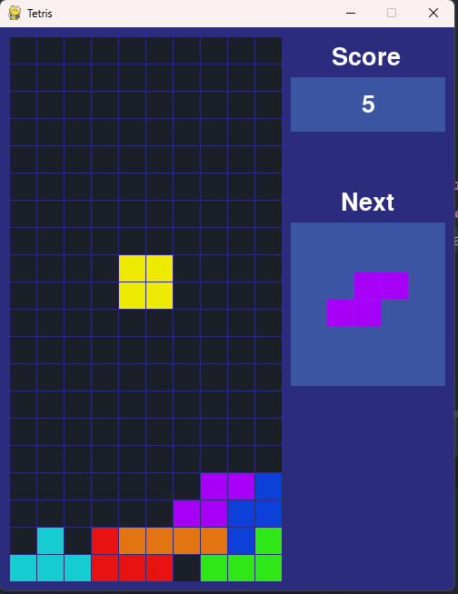

# Tetris

This is a simple Tetris game written in Python using the Pygame library. Created as part of [happycoders.io](https://happycoders.io/) tutorial. Resources have been collected from the youtube channel [Programming With Nick](https://youtu.be/nF_crEtmpBo?si=Cois7QYjjq9l48_e).
Thanks to **Nick** for the tutorial.

## Installation

1. Clone the repository
2. Install the required dependencies using `pip install -r requirements.txt`
3. Run the game using `python tetris.py`
4. Enjoy!

## Screenshots

## Controls
- **Left Arrow** - Move piece left
- **Right Arrow** - Move piece right
- **Down Arrow** - Soft drop
- **Spacebar** - Rotate piece

## Features
- [x] Keyboard controls
- [x] Score tracking
- [x] Game over detection
- [x] Next piece preview
- [x] Sound effects
- [x] High score tracking
